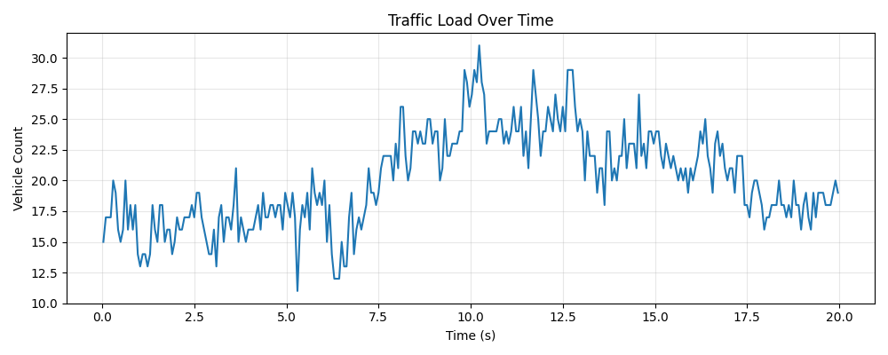
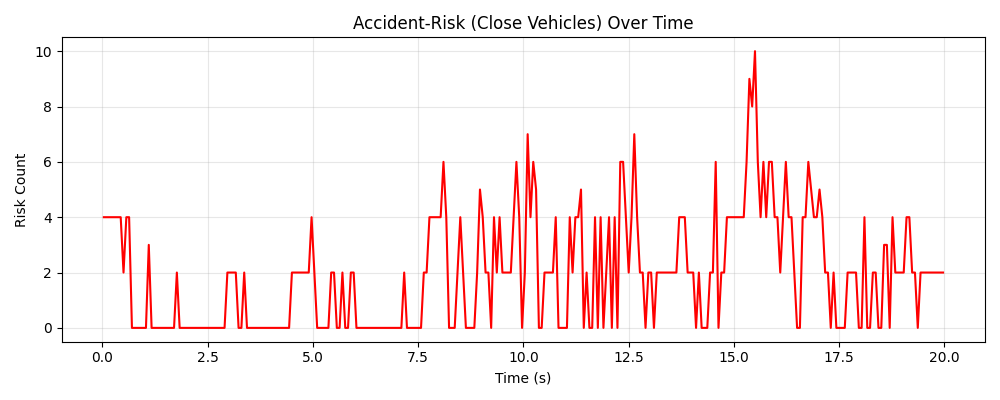
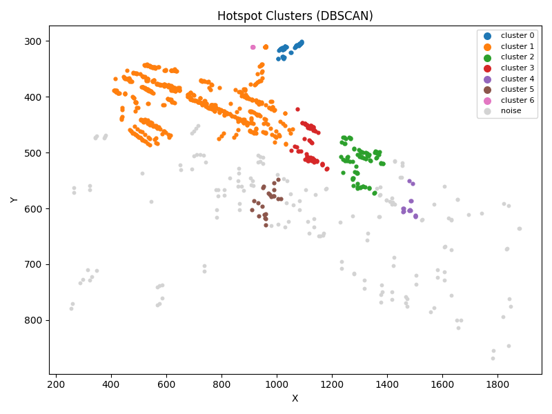

# 🚦 Traffic Risk Analysis using YOLO & Hotspot Clustering

<div align="center">

> A data-driven approach to making chaotic roads safer through intelligent computer vision


</div>

---

## 🌍 Why This Matters

In cities where traffic laws struggle to keep pace with rapid urbanization, accidents are a daily reality. Chaotic intersections, aggressive driving, and inadequate enforcement create dangerous conditions for everyone on the road.

**This system provides the data and insights cities need to:**

- 📍 Identify accident-prone zones with precision
- 📊 Quantify traffic risk patterns over time
- 🎯 Prioritize safety interventions based on real evidence
- 🚨 Support traffic management decisions with visual proof

---

## 📸 System in Action

### Real-Time Vehicle Detection & Risk Assessment

<div align="center">
  
  <p><em>Vehicle count trends over time - Understanding traffic density patterns helps cities plan better infrastructure</em></p>
</div>

### Accident Risk Tracking

<div align="center">
  
  <p><em>Real-time risk detection - Spikes indicate dangerous moments where multiple vehicles come dangerously close</em></p>
</div>

### Hotspot Identification

<div align="center">
  
  <p><em>DBSCAN clustering reveals accident-prone zones - These red clusters show exactly where cities should focus their safety efforts</em></p>
</div>

---

## ✨ Features

### 🚗 Intelligent Vehicle Detection

- Powered by **YOLO11s** for accurate real-time detection
- Filters vehicle classes: cars, trucks, buses, motorcycles
- Optimized frame processing for faster analysis
- Smart confidence thresholding to reduce false positives

### ⚠️ Collision Risk Assessment

- Calculates midpoint distances between all vehicles
- Identifies dangerous proximity (< threshold distance)
- Visual alerts: 🔴 Red = Risky | 🟢 Green = Safe
- White lines connect vehicles in dangerous proximity
- All risky interactions logged for analysis

### 🌀 Smooth Tracking

- Nearest-neighbor matching across frames
- Exponential smoothing eliminates detection jitter
- Stable bounding boxes for better visualization

### 📊 Automatic Analytics

Three powerful outputs generated automatically:

| Visualization | Insight Provided |
|--------------|------------------|
| **Traffic vs Time** | Understand peak hours and traffic flow patterns |
| **Risk vs Time** | Identify when accidents are most likely to occur |
| **Hotspot Map** | Pinpoint exact locations requiring safety intervention |

### 📝 Comprehensive Logging

**`traffic_log.csv`**
- Frame-by-frame vehicle counts
- Risk counts per frame
- Timestamps and FPS metrics
- Perfect for time-series analysis

**`hotspot_points.csv`**
- Coordinates of every risky interaction
- Used for DBSCAN clustering
- Enables geographic hotspot mapping

---

## 🚀 Quick Start

### Prerequisites
```bash
pip install ultralytics opencv-python numpy pandas matplotlib scikit-learn
```

### Usage

**1. Place your traffic video in your project directory**

**2. Update the video path in the script:**
```python
VIDEO_PATH = "/path/to/your/traffic_video.mp4"
```

**3. Run the analysis:**
```bash
python traffic_analysis.py
```

**4. View results:**
- 📁 CSV logs saved in project root
- 📊 PNG visualizations in `outputs/` folder

---

## ⚙️ Configuration

Customize the system behavior by adjusting these parameters:
```python
DIST_THRESHOLD        # Risk distance (pixels) - Lower = stricter
MIN_CONF             # YOLO confidence (0-1) - Higher = fewer false positives
RESIZE_WIDTH         # Frame width - Lower = faster processing
PROCESS_EVERY_N      # Frame skip - Higher = faster analysis
DBSCAN_EPS           # Hotspot cluster radius
DBSCAN_MIN_SAMPLES   # Minimum points per cluster
```

---

## 🎯 Use Cases

<div align="center">

| City Planners | Traffic Police | Researchers |
|--------------|----------------|-------------|
| Identify intersections requiring traffic lights or roundabouts | Deploy officers at high-risk times and locations | Study traffic behavior patterns |
| Justify infrastructure investments with data | Document dangerous driving patterns | Validate traffic flow models |
| Monitor effectiveness of safety interventions | Support enforcement strategy with evidence | Analyze the impact of road design changes |

</div>

---

## 🔄 Processing Pipeline

<div align="center">
```
📹 Video Input
    ↓
🔍 YOLO Detection (Vehicle ID)
    ↓
📐 Bounding Box Smoothing
    ↓
⚠️  Risk Calculation (Distance Analysis)
    ↓
💾 Data Logging (CSV)
    ↓
🎨 Visualization (Annotated Video)
    ↓
📊 Analytics Generation (Auto-plots)
    ↓
🗺️  Hotspot Clustering (DBSCAN)
```

</div>

---

## 📈 Future Enhancements

- [ ] **Advanced Models**: YOLO11m, RT-DETR for better accuracy
- [ ] **Speed Analysis**: Factor in velocity vectors for better risk assessment
- [ ] **Heatmap Overlays**: Visual intensity maps on actual road layouts
- [ ] **Perspective Correction**: Real-world distance measurements
- [ ] **Real-time Dashboard**: FastAPI + WebSockets for live monitoring
- [ ] **GPS Integration**: Map hotspots to real geographic coordinates
- [ ] **Multi-camera Fusion**: City-wide network analysis
- [ ] **Predictive Alerts**: ML-based accident prediction

---

## 🤝 Contributing

This project is open-source and welcomes contributions! Whether you're improving detection accuracy, adding new features, or optimizing performance - your input helps make roads safer.

---

## 📄 License

Open-source for learning, research, and experimental use.

---

## 💡 Impact Statement

<div align="center">

*In cities where traffic enforcement is challenging, data becomes the first step toward safer roads. This system transforms hours of chaotic traffic footage into actionable insights that save lives.*

**Every hotspot identified is a potential accident prevented.**

**Every risk pattern revealed is an opportunity for intervention.**

---

**Made with ❤️ for safer cities**

</div>
